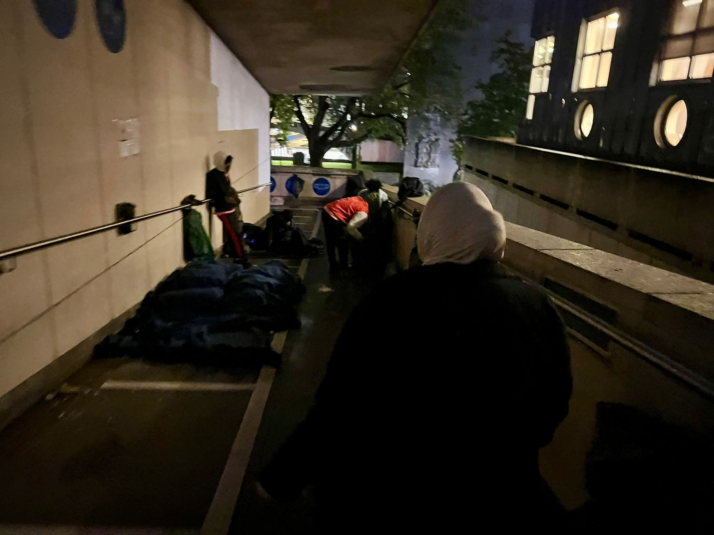
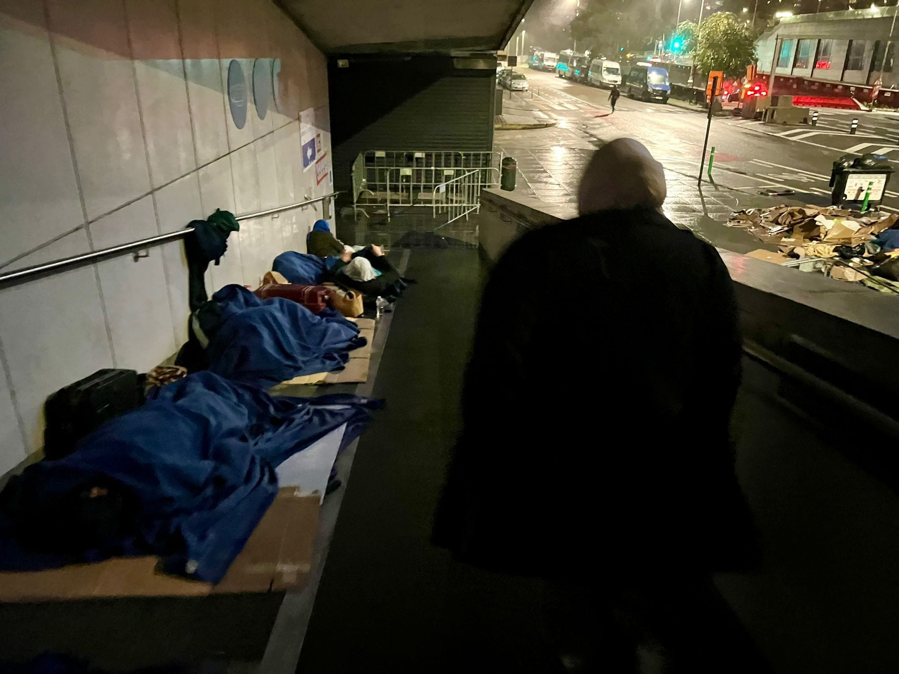

### AYS News Digest 10/11/23: Sleeping rough in the heart of Europe
#### Sea rescues // Outrage at Albania announcement // German law seeks to criminalise sea rescue // Report on the investigation into 2022 UK Channel shipwreck // Worth reading
#### FEATURE
### Sleeping rough in the heart of Europe: Brussels

As in every other European country, homelessness has risen in Belgium, with governments all over failing to prioritise housing as a basic right. Asylum seekers are amongst those suffering.

An activist from Brussels, Belgium shares her impressions and shock upon recently visiting people sleeping rough in the city:

“(…) we arrived upstairs, 30 young men are sleeping in miserable conditions. **No water, electricity, or just a decent blanket** .
I don’t want to imagine what it would actually look like in daylight. I hardly dare to look around in fear of what I would see and what it would do to me or out of fear and shame that I can’t do much more for these people”, she writes.

Second stopover — “the infamous asylum and international protection registration point. At 5 meters from the main entrance there is an abandoned open parking facility. I’m guessing at 3rd floor **in every parking slot a piece of cardboard and a blanket or someone without a blanket** . It’s open, just a cover, it’s windy and it’s raining, we’re even chatting wet until we’re upstairs.”

> On the top, single tents of wet shoes and jackets, without protection against the wind on an open roof. 

> Completely soaked with only a thin blanket or nothing to cover itself I’m still trying to control my mind. 

> By the time we get downstairs we see an older woman I guess something about 60 years old, wrapped in a blanket and eating the meal we brought. 

> Should there be more deaths due to hypothermia? Do more people have to commit suicide out of desperation? Or do more people need to go psychologically completely out of it? 

Each month, approximately 3,000 people apply for asylum, compared with only 2,000 case decisions being made. This has led to a current backlog of over [23,500 outstanding asylum applications in Belgium](https://www.cgrs.be/en/news/asylum-statistics-september-2023) . The people who are seeking international protection come from:
1. Syria 2. Afghanistan 3. Turkey

with the top 10 countries completed by Palestine, Guinea, Cameroon, Eritrea, Congo (DRC), Russia and Moldova. Over 44% of cases are granted protection.

If you want to help, [get in touch](https://www.facebook.com/lbajramovic?__cft__[0]=AZXihAlDDuo0wYdazM-Q1uSAcbuU1ALs4nIE3zKpwTdyZBQIgYl062r10jC_RLaWubIG_BjN36arhtF9XDUSt91PLCkEX7ZiounFWqZ9j0Tt9AERLanju93E1KPuxeEeqfnHC3YvbGMPPBob-NSMnl4qTpzOtRmJXRvDYkjXbNocaw&__tn__=-UC%2CP-R) , and **help out by cooking, transporting meals to Brussels, going shopping for food with the volunteers, bringing ingredients inside or donating so that they can buy what is needed,** 
**donate: men’s clothing, shoes, socks, underwear, blankets, sleeping bags, duvets.**

Local photographer [Tessa Kraan’s portrait project](https://www.instagram.com/p/CpFRD8vMAaH/?utm_source=ig_web_copy_link&igshid=ODhhZWM5NmIwOQ==) shows the individuals behind the numbers.

#### SEARCH AND RESCUE AT SEA

81 people reached the smallest of the Canary Islands –El Hierro — on Thursday. **One person on board had died.**

Some sang as their boat entered La Restinga port, Reuters reports.

**NGO EMERGENCY** has performed a rescue in conditions with three-metre-high waves. In two different operations in international waters near Malta, 118 people were rescued. They were found after over three days without food or water.

■■■■■■■■■■■■■■ 
> **[EMERGENCY NGO](https://twitter.com/emergency_ngo) @ Twitter Says:** 

> > "They had been floating in the Mediterranean for over three days, running out of water, food. They were risking their lives."
After rescue operations of 118 people, amid waves up to 3 metres high, EMERGENCY President @[rossmiccio](https://twitter.com/rossmiccio) sends an update from on board #LifeSupportSAR. https://t.co/pfg7JSjpS7 

> **Tweeted at [2023-11-10 11:29:47](https://twitter.com/emergency_ngo/status/1722939606440583649?fbclid=IwAR0wS7iOtCSfj6FPvZeTDdLzmC5rx7rcV5vkNs2HY6QOI9FKK_2rpEHK8CA).** 

■■■■■■■■■■■■■■ 

Meanwhile, [MARE\*GO is leaving the search and rescue zone](https://twitter.com/marego_vessel/status/1722608192130314471?fbclid=IwAR3MIwUg3SF7-oJeg6x14IZ40RLl6UZykB4FOdAFRxhUbclM-xiTO1a7_FU) due to the weather and will not return this year.
#### ITALY and ALBANIA
### Outrage at Albania announcement

As reported in [this News Digest](https://medium.com/are-you-syrious/ays-news-digest-6-11-23-albania-to-host-pom-who-cross-to-italy-c3f2894dd746) , plans to host those rescued at sea in Albania have been unveiled. The plan to externalise asylum claims and the context surrounding this deal are clearly outlined in [this report by Italian NGO EMERGENCY](https://en.emergency.it/press-releases/the-italy-albania-agreement-yet-another-attack-on-the-right-to-seek-asylum/?fbclid=IwAR0gKCh5sLK5x-ZIumOboBjWjGPKUpRtJ_hnPz2aYUXsdvrAPgyodd4DNWE) .
#### GERMANY
### Law seeks to criminalise sea rescue

A [new law is being drafted](https://sea-watch.org/bundesregierung-droht-mit-bis-zu-5-jahren-haft/?fbclid=IwAR0qIR8IH3dHE2Ea32n3-GTzcQzbOYDnpImTqSmwZRm17vd2_nHZU41tc-0) by the Interior Ministry that could potentially criminalise sea rescue. This seems like a bit of a desperate lunge, but it is alarming all the same. The distinction between people-smuggling and humanitarian assistance at this time hinges on whether or not the assisting person or organisation receives any material or financial benefit. This legal push proposes to do away with that. This law is opposed by many groups and is expected not to pass through the Bundestag. However a petition has been started. [Sign here.](https://weact.campact.de/petitions/keine-haft-fur-zivile-seenotrettung)

■■■■■■■■■■■■■■ 
> **[Sea-Eye](https://twitter.com/seaeyeorg) @ Twitter Says:** 

> > Keine Haft für Seenotrettung! Das fordern wir jetzt in einer Petition - gemeinsam mit @[seawatchcrew](https://twitter.com/seawatchcrew) , @[lnob2020](https://twitter.com/lnob2020), @[United4Rescue](https://twitter.com/United4Rescue) , @[soshumanity_de](https://twitter.com/soshumanity_de) , @_Seebruecke_  und vielen weiteren. Bitte unterzeichne auch du sie: [weact.campact.de/petitions/kein…](https://weact.campact.de/petitions/keine-haft-fur-zivile-seenotrettung) 

> **Tweeted at [2023-11-09 17:06:10](https://twitter.com/seaeyeorg/status/1722661871608582372?s=20).** 

■■■■■■■■■■■■■■ 

Sea Watch — which operates two rescue ships and two observation planes — is registered as an NGO in Germany. [The political shift towards the right is the subject of their post here.](https://sea-watch.org/solidaritaet-ist-keine-sonntagsrede/?fbclid=IwAR3MIwUg3SF7-oJeg6x14IZ40RLl6UZykB4FOdAFRxhUbclM-xiTO1a7_FU)
#### UK
### Report on the investigation into the sinking leading to 27 lives lost

The Marine Accident Investigation Branch (MAIB) has published Accident Investigation Report 7/2023, entitled ‘Report on the investigation into the flooding and partial sinking of an inflatable migrant boat resulting in the **loss of at least 27 lives** in the Dover Strait on 24 November 2021
#### Summary

During the early hours of the morning on 24 November 2021, an inflatable boat with around 33 people on board became flooded and partially sank in the Dover Strait as the occupants were attempting to cross from France to the UK.

As a result of the flooding the boat’s occupants entered the water and at least 27 people lost their lives. There were two survivors and four people remain missing. The victims’ bodies and the two survivors were recovered later that day in French waters.

The time and location of the partial sinking and the exact number of people on board are unknown. The MAIB investigation was not granted access to any information held by the French authorities and has necessarily focused on the UK’s emergency response.
#### Safety issues
- the inflatable boat was wholly unsuitable and ill-equipped for the crossing attempt and the occupants’ only method of raising the alarm was via mobile phone
- the effectiveness of the UK’s search and rescue response was hampered due to poor visibility and the lack of dedicated aerial surveillance of the Dover Strait
- with multiple boats attempting to cross the Dover Strait, and each boat making multiple calls indicating distress, it was extremely challenging for HM Coastguard to locate and identify discrete boats and to understand exactly how many were attempting the crossing
- at the time of the accident, a number of HM Coastguard capacity enhancements had been identified but were not yet in place to support the UK’s emergency response

[Statement from the Chief Inspector of Marine Accidents](https://www.gov.uk/government/news/inflatable-migrant-boat-report-published#ci-statement)
#### WORTH READING
- [The New Humanitarian | Snapshots: How Sudan’s conflict is impacting Darfur](https://www.thenewhumanitarian.org/photo-feature/2023/11/07/snapshots-how-sudans-conflict-impacting-darfur?utm_source=The%20New%20Humanitarian&utm_campaign=3e2dc108f7-EMAIL_CAMPAIGN_2023_11_10&utm_medium=email&utm_term=0_d842d98289-3e2dc108f7-75695722&fbclid=IwAR1AtKKngD5kiglSYkyW9qIW7E6_UjzRLgZFmqY4MmN36GSfRjicuvgNFzM)
- Joint Jewish-Palestinian efforts look to salvage vision of a shared society: ‘We’re in the middle of a war… but we are meeting together to plan the future — [In Israel, joint Jewish-Palestinian efforts look to salvage vision of a shared society](https://www.thenewhumanitarian.org/news-feature/2023/11/09/jewish-palestinian-efforts-for-shared-society?utm_source=The%20New%20Humanitarian&utm_campaign=3e2dc108f7-EMAIL_CAMPAIGN_2023_11_10&utm_medium=email&utm_term=0_d842d98289-3e2dc108f7-75695722&fbclid=IwAR3U9AQkL4fLdP9XmrHdoYZWI9AOjbAA5fu4uL3-Kqgabh3TCFx_Y3sQBm0)

> **Find regular updates and special reports on our [Medium page](https://medium.com/are-you-syrious) .** 

> **If you wish to contribute, either by writing a report or a story, or by joining the AYS Info team, please let us know!** 

**We strive to echo correct news from the ground through collaboration and fairness. Every effort has been made to credit organisations and individuals with regard to the supply of information, video, and photo material (in cases where the source wanted to be accredited). Please notify us regarding corrections.**

**If there’s anything you want to share or comment, contact us through Facebook, Twitter or write to: areyousyrious@gmail.com**

_[Post](https://medium.com/are-you-syrious/ays-news-digest-10-11-23-sleeping-rough-in-the-heart-of-europe-9d799e5c54e3) converted from Medium by [ZMediumToMarkdown](https://github.com/ZhgChgLi/ZMediumToMarkdown)._
