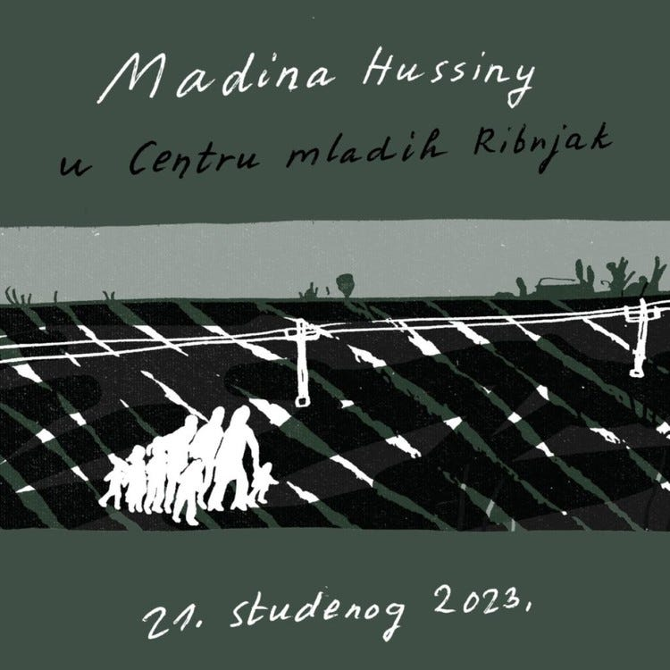
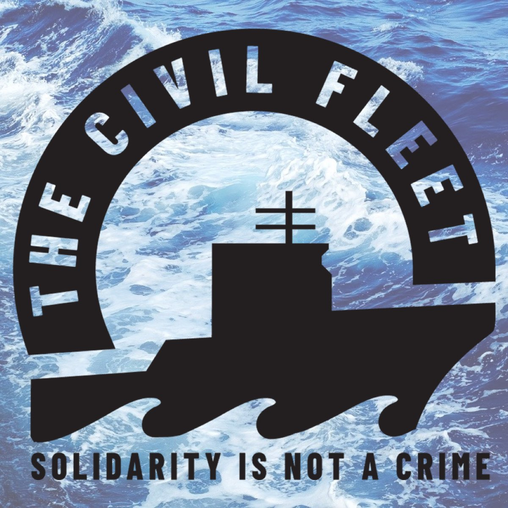

### AYS News Digest 20/11/23: The continued criminalisation of sea rescue organisations
#### Pressure — Sea Watch International received a warning from the Italian Civil Aviation Authority // New report on the inaccessibility of the Greek asylum system // Italian NGO **petition for a new law on residence permits and social integration // 52 organisations call for the German MoI to** exclude sanctions against humanitarian aid // remembering Madina Hussiny

 reported.](../assets/2af314d359f0/0*NpVdJ0ZNvdeYFD_y)

On the night of Nov 20th 49 people were disembarked safely in Lampedusa. Among them were 22 women, six children and six minors. They had survived at sea for over four days in rough weather, many had fuel burns and were in a very bad condition, but still showed great strength, [RESQSHIP](https://twitter.com/resqship_int) reported.
#### FEATURE

The Italian government systematically attempts to intimidate NGOs that rescue people in distress. The main political discourse fuelled by the current government in Italy focuses on the criminalisation of people who try to reach a safe country and on intimidating NGOs, organisations and people who support them. [While people continue to be left in dangerous situations in the middle of the sea](https://twitter.com/resqship/status/1724776432059224449?fbclid=IwAR0n8tJB7zkzie6xV-jLVvp7ICFbGaCsLhrPMfa4aggi1C5SzVa1PTQ2yio) , governments continue to be absent. Therefore, warnings such as the one received by Sea Watch are the evidence of Italian politics: people’s lives are a political playground. As Sea Watch tweets:

> They claim that the support of distress cases in the Mediterranean is solely the state’s responsibility. It’s an abuse of power aimed at deterring us from our life-saving flights amidst a rising death toll 

■■■■■■■■■■■■■■ 
> **[Sea-Watch International](https://twitter.com/seawatch_intl) @ Twitter Says:** 

> > Attempt by the Italian government to intimidate us.

We received a warning from the Italian Civil Aviation Authority about our aerial monitoring work in the Central Mediterranean.⬇️ 

> **Tweeted at [2023-11-15 18:16:31](https://twitter.com/seawatch_intl/status/1724853904876110133?fbclid=IwAR2vo7VUfwIhagMLjHDHa5dJdv3EHAozP3hvOF0wbDOo9C4XGxGqtzgZoCk).** 

■■■■■■■■■■■■■■ 

This type of criminalisation is not an occasional event, but it is systematic and structural. In fact, on the same day Sea Watch received this warning, SOS Mediterranee was fined and the [Ocean Viking](https://www.marinetraffic.com/en/ais/home/shipid:311954/zoom:10) detained for 20 days because of a rescue.

■■■■■■■■■■■■■■ 
> **[SOS MEDITERRANEE](https://twitter.com/SOSMedIntl) @ Twitter Says:** 

> > 🔴Yesterday, Italian authorities detained #OceanViking for 20 days + a 3,300€ fine after @[SOSMedIntl](https://twitter.com/SOSMedIntl) rescued people in distress in Libyan SRR. Libyan authorities didn't give any instruction nor information about these people left in the middle of the sea. [en.sosmediterranee.org/news/press-rel…](https://en.sosmediterranee.org/news/press-release-ocean-viking-paying-the-price-for-lack-of-coordination-from-libyan-maritime-authorities-with-20-day-detention-and-fine/) 

> **Tweeted at [2023-11-16 13:57:47](https://twitter.com/SOSMedIntl/status/1725151178332274700?fbclid=IwAR0p5XwS47dTJMCg53wkSttSKXZrkl7-GBBLEFe0EZ_enINNoPwEf6r0QQA).** 

■■■■■■■■■■■■■■ 

These organisations resist and continue to support and save people’s lives in the face of absence or inadequacy of governments and the EU. [Here is a film](https://twitter.com/seawatch_intl/status/1725541025744081056?fbclid=IwAR27ZTLfzgJUzQaxAI5rT-Hxz71VdBGqxI-bbZwhZxYBCkOZS8pE7dzpOUo) edited by Sea Watch about the main aim of their efforts: defending the right to life.
#### AIR-SEA RESCUE
### Deaths in the sea

A woman has died and 19 people were rescued after their boat sank in the eastern Aegean Sea, [IM](https://www.infomigrants.net/en/post/53342/greek-coast-guard-rescues-migrants-accused-of-further-pushbacks) reported. At the same time, the Greek coast guard has once again been accused of illegally pushing boats back to Turkey.

So far in 2023 nearly 40,000 people have arrived in Greece, mostly crossing from Turkey by sea, according to data from the UNHCR.

A boat was shipwrecked near Lampedusa on Monday and a **two** **year-old child has been found dead, while eight people were still considered missing** at the time of publication. 42 people were rescued by two fishing vessels and a coast guard boat. Local [media](https://www.lasicilia.it/cronaca/barcone-naufraga-a-lampedusa-morta-una-bimba-di-due-anni-ma-ci-sono-altri-otto-dispersi-1960234/) reported about the tragic happening.
#### EU
### Deaths gone from ‘preventable’ to ‘tolerable’ to ‘necessary’ in the name of protecting EU’s borders

In a statement published on [their website](http://migreurop.org/article3211.html?lang_article=fr) , Migreurop commented on the evolution of European migration policies, denouncing the fact that in recent decades, deaths have “gone from ‘preventable’ to ‘tolerable’ to ‘necessary’ in the name of protecting Europe’s borders”.

The network “recalls the exorbitant price of the security escalation and the overwhelming responsibility of European States in the constant endangerment of people in migration, who try to exercise their right to mobility at the cost of their lives.”

> **“…the deaths of exiled people are risks assumed by both sides, the responsibility for these deaths being transferred to the first concerned and their relatives, guilty of having wanted to defy the ban on travel, of having exercised their right to mobility… At their own risk.”** 

#### GREECE
### New report on the inaccessibility of the asylum system in Greece

New research from Mobile Info Team and Refugee Legal Support (RLS) examines the impacts of the new system for applying for asylum in mainland Greece, Crete and Rhodes, introduced in September 2022.

> “Over the last year, accessing these centres on mainland Greece has proven to be fraught with “technical difficulties” as the online platform to book appointments told people there were “no dates available” or simply displayed an error message. People trying to access the the Reception and Identification Centres were even arrested, as were those waiting months for their appointments without access to their basic rights.” 

> **\- Lucy Alper, Athens Legal Clinic Coordinator, RLS** 

[Read the full report here](https://static1.squarespace.com/static/597473fe9de4bb2cc35c376a/t/6555e476024c6b1f747d3668/1700127869016/RIC+report+Nov+2023.pdf)
#### ITALY
### Petition condemning the unacceptable stalling

**_Ero Straniero — L’umanità che fa bene_** (I Was a Foreigner — When Being Human Does Good) campaign is a collaborative effort by associations: A Buon Diritto, ActionAid, ASGI, the Federation of Italian Evangelical Churches (FCEI), Oxfam, Arci, CNCA, CILD, and the Foundation Home of Charity “Angelo Abriani,” along with Radicali Italiani, who have collected signatures for a **petition demanding “a new law on residence permits and promoting social integration for migrants”.**

The campaign denounces the very serious delays in the implementation of the amnesty granted in 2020 by the Italian government for people on the move to obtain a residency permit. This is particularly in the prefectures of Rome and Milan, where **less than 60% of the requests have been examined.**

Amongst other costs, they ask for 105 million euros to be provided to strengthen the personnel serving in the prefectures and an additional 150 million euros for those at police stations. This is currently under discussion as part of the finance bill under different areas of expenditure.
#### FRANCE
### Two people died when hit by a van near Calais

There are not yet many details, but what is certain is that the van drove away having killed two people and injured another four.

#### GERMANY
### Prevent criminalization of sea rescuers!

**Joint statement by 52 organisations** in Germany calls on the Federal Ministry of the Interior to submit to the Federal Cabinet an amended wording aid in which the extension of paragraph 96 is withdrawn. In addition, we call for the inclusion of a humanitarian clause, such as that provided for in Article 1(2) of Directive 2002/90/EC, in order to exclude sanctions against humanitarian aid.

If the Ministry of the Interior does not propose a new wording aid to the Federal Cabinet, we call on the **members of the German Bundestag** to take up these changes in a motion and introduce them in the parliament.

We agree with the criticism expressed during the association’s hearing about the accelerated legislative process and appeal to all actors involved to listen to the expertise of civil society and take it into account in their decisions.

Sea rescue and humanitarian aid must not be criminalized and hindered in and by Germany!

[Prevent criminalization of sea rescuers](https://sea-watch.org/kriminalisierung-von-seenotretterinnen-verhindern/)

### Remembering Madina

On a cold November night in 2017, six year old Madina entered Croatia from Serbia with her family, seeking asylum. However, as had happened before and would happen again, they were stopped by the police and pushed back.

Following orders, Croatian police officers forced the family to follow the train tracks back to Serbian territory. No asylum for you, they probably said, like so many times before.

Madina was hit by a train and died minutes after the push-back.

The State Attorney’s Office of the Republic of Croatia later decided no one was responsible for the death of the girl.

Since then, Madina’s family has tried several times to enter Croatia and express their intention to seek asylum. They finally managed to do that, but were put in detention, while their application for asylum had been rejected on the grounds of Serbia being a safe country.

The day before the decision was published, [Croatian police officers](https://medium.com/are-you-syrious/ays-daily-digest-31-05-2018-two-refugee-children-shot-by-croatian-police-5c3c811e0f07) shot two children, both 12 years old. They were trying to enter the country from Bosnia, in a van with 28 people. No one was charged for that.

Finally, in 2021 the [ECHR served justice for Madina, and Croatia was found guilty](https://medium.com/are-you-syrious/ays-news-digest-17-11-21-echr-serves-justice-for-little-madina-croatia-found-guilty-cbf8e70f6e84) . This will not bring back the little girl who would today be playing, learning, shaping hers and other lives around her while entering the age of adventure, rebellion, discoveries and youth. Her life was stopped in the age when she should have been playing, not running to save her life.

Now, on the sixth anniversary of her death, we remember to never forget, to fight for others like her and to keep a memory of her life, this time through an initiative of naming a playground in Zagreb after Madina. Read more: [Šesta obljetnica pogibije Madine Hussiny](https://www.portalnovosti.com/sesta-obljetnica-pogibije-madine-hussiny)

#### WORTH READING / LISTENING TO
- The Civil Fleet podcast has released its 50th episode, ‘Abolish Frontex’:

- The documentary “Route 4” tells about the journey of people on the move through Libya across the Mediterranean to Europe while giving an insight into rescue operations:

■■■■■■■■■■■■■■ 
> **[Sea-Eye](https://twitter.com/seaeyeorg) @ Twitter Says:** 

> > 🎬 Jetzt kostenlos online verfügbar: Der Dokumentarfilm “Route 4”! Er begleitet Flüchtende durch die Hölle Libyens über das Mittelmeer bis nach Europa - und gibt einen hautnahen Einblick in unsere Rettungseinsätze! #LeaveNoOneToDie!

➡️ Zum Stream: [joyn.de/filme/route-4](https://www.joyn.de/filme/route-4) https://t.co/OCGErIDXpQ 

> **Tweeted at [2023-11-15 14:30:00](https://twitter.com/seaeyeorg/status/1724796900279562628?fbclid=IwAR0VvBlo5F_3cZP283vzQaPjj0OonmKWI4XzXT0hRh9it6ZxNJza3ptdt64).** 

■■■■■■■■■■■■■■ 

- An interesting online event on 21st of November:

- NGO Venro started a petition challenging the Interior German Ministry’s attempt to criminalise solidarity with displaced persons:

■■■■■■■■■■■■■■ 
> **[VENRO](https://twitter.com/venro_eV) @ Twitter Says:** 

> > PETITION: Keine Kriminalisierung von ziviler uneigennütziger #Seenotrettung. Mit der geplanten Änderung des #Aufenthaltsgesetzes können zivile Seenotretter_innen wie Schleuser mit langen Haftstrafen belegt werden. Flüchtlingsschutz bleibt auf der Strecke: [sos-humanity.org/unser-einsatz/…](https://sos-humanity.org/unser-einsatz/veraendern/keine-haft-fuer-zivile-seenotrettung/) 

> **Tweeted at [2023-11-16 05:13:00](https://twitter.com/venro_eV/status/1725019111665676588?fbclid=IwAR1n_TQgewjsiXcND1fXNIhRbQxKqu6QmHshsYJbTWWyMEducF0vR9NxxhA).** 

■■■■■■■■■■■■■■ 

> **_Find regular updates and special reports on our [Medium page](https://medium.com/are-you-syrious) ._** 

> **_If you wish to contribute, either by writing a report or a story, or by joining the AYS Info team, please let us know!_** 

> **_We strive to echo correct news from the ground through collaboration and fairness. Every effort has been made to credit organisations and individuals with regard to the supply of information, video, and photo material (in cases where the source wanted to be accredited). Please notify us regarding corrections._** 

> **_If there’s anything you want to share or comment, contact us through Facebook, Twitter or write to: areyousyrious@gmail.com_** 

_[Post](https://medium.com/are-you-syrious/ays-news-digest-20-11-23-the-continued-criminalisation-of-sea-rescue-organisations-2af314d359f0) converted from Medium by [ZMediumToMarkdown](https://github.com/ZhgChgLi/ZMediumToMarkdown)._
