### AYS Special: Talking Palestine in Croatia
#### On the actions and importance of local solidarity movements, in a story about a group in Croatia gathering diverse and strong voices in support of Palestine.

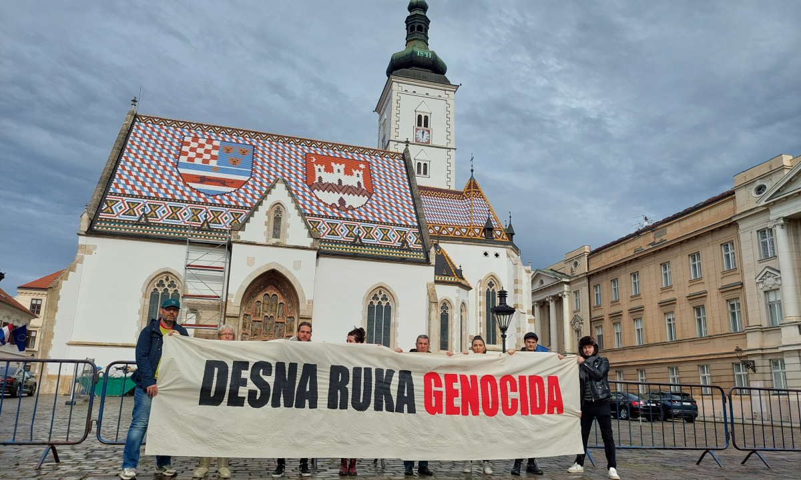

Activists of The Free Palestine Initiative at the St Mark’s Square in Zagreb, centre of both the Parliament and the Croatian Government, with a sign that reads: “Right hand of the genocide” / Photo: The Initiative

> The tragedy of the people that have been tortured, abandoned, and globally marginalized for decades will not pass easily. Shame will remain at the forefront of our humanity, something the children of the future will read about in history books. 

> Peace for the land created for peace, yet it saw none. 

> \- The Free Palestine Initiative, May 2023 

The Free Palestine Initiative is a leading civic and activist group in Croatia in the solidarity and fight for the rights of the Palestinians.

Standing up for political and peace solutions, for justice for Palestine, its peoples, and those who have been expelled from it, the group also supports the Israeli intellectuals, Jews and other citizens, including the families of those killed in the assaulted kibbutzes, who are protesting against retaliation of the Israeli authorities and the continuation of the apartheid and occupation of Palestine.

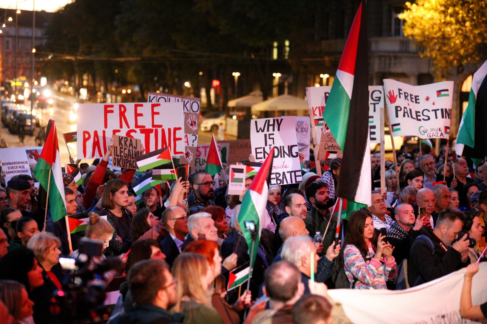

Solidarity gathering in support of Palestine at the Square of the Victims of Fascism in Zagreb / Photo: Dag Oršić ©

> _As the Initiative stresses in the latest call for support of Palestine_ , “we are witnessing increased number of protests that demand stopping of genocide and a free Palestine around the world, as well as in Israel, where thousands of people protest their ultra-right, fascist government, while young people refuse to serve in the military, risking incarceration. 

> And thanks to the Republic of South Africa, Israel is finally set to appear before the International Court of Justice on charges of genocide. Public hearings of both parties in The Hague are scheduled for January 11 and 12.” 

On the same weekend, Croatia will be one of the many places that will organise another march in support of the people in Palestine.

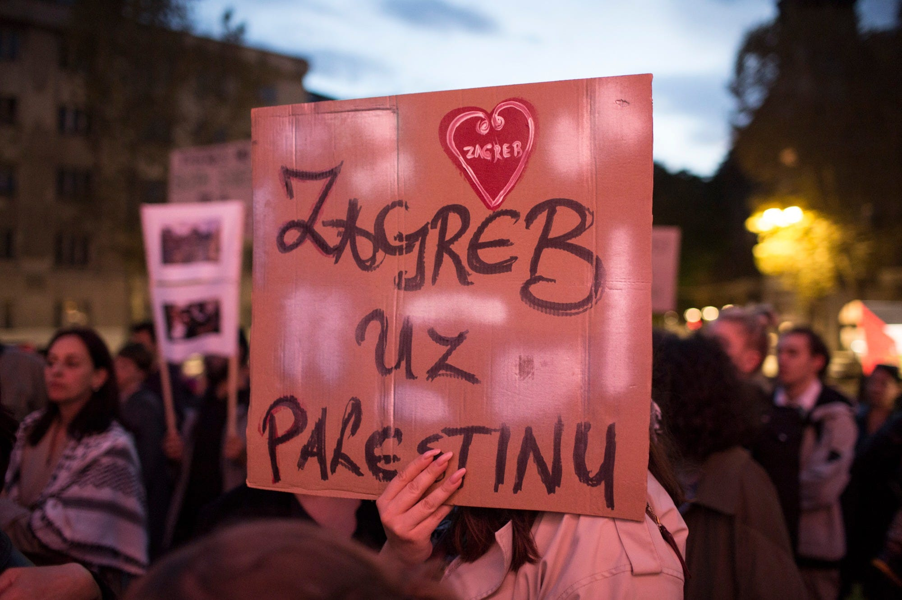

Photo: Bojan Mrđenović ©

The general notion in the media seems to be that all across Europe people are being silenced, threatened or deterred from standing in solidarity with the Palestinians. Although several countries in Europe openly have this stance regarding pro-Palestinian initiatives, in most cases this is not true. Such reporting additionally confuses those who are used to others standing up against injustices and too inert to do so themselves. People should not use the possibility of such pressure being applied in other places in Europe as a reason to sit back and show no indignation or support.

![Together with the association \[BLOK\] — Local Base for Refreshing Culture, a temporary monument was built for the children killed in Palestine under the title “And children? And children too.” The monument is made of worn-out children’s shoes that were donated by citizens of Zagreb and other cities. / foto: Tamara Opačić ©](../assets/951f56502503/1*B1QFU32OvxA6I03xWnOPzw.jpeg)

Together with the association \[BLOK\] — Local Base for Refreshing Culture, a temporary monument was built for the children killed in Palestine under the title “And children? And children too.” The monument is made of worn-out children’s shoes that were donated by citizens of Zagreb and other cities. / foto: Tamara Opačić ©

At each of the gatherings and protests in Croatia there were police and other officials closely monitoring events, and even video recordings of everything that was being said, sung, shown or done, there has so far been no explicit suppression of pro-Palestinian expression or solidarity actions in this country.

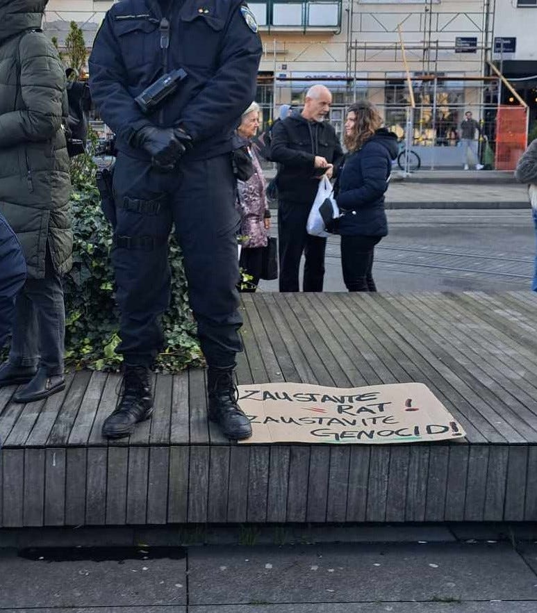

Photo: KR

Each of the demos and solidarity gatherings or actions organised by the Initiative had a specific focus and included different and diverse people contributing and leading the events, making it possible for voices from across the wide spectrum of supporters and members of the Palestinian or refugee communities to take part. This has also avoided exposing anyone to attention or pressure that might be used against them in the process of obtaining international protection or any other official procedure including them or their family members.

However, some of the people who took part in the protests later reported silencing and threats from particular institutions they were reluctant to identify, as mentioned in an earlier [interview](https://lefteast.org/we-asked-how-is-the-suppression-of-palestinian-solidarity-unfolding-in-croatia/?fbclid=IwAR17phJ8W8BhHIljz3lBwdS0PQmWokhYnXEx0587i004wKiuTKVL0azj9yQ) .

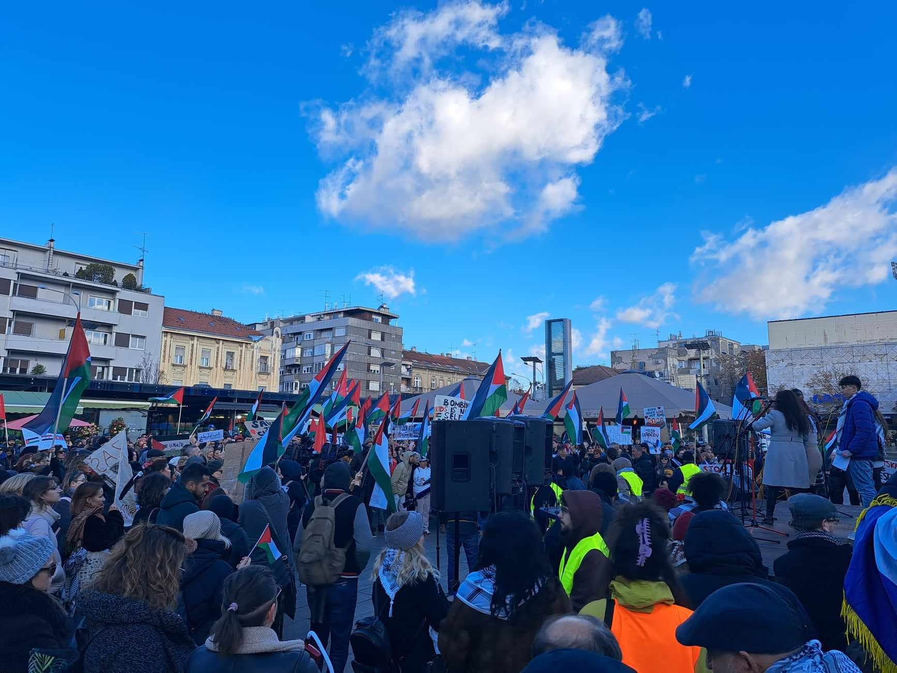

Photo: KR

This does not come as a surprise, given what they experience, witness and see around them. The police still forbids people from boarding trains towards Slovenia and Austria, as we witnessed ourselves in the past few days. People are still being racially profiled (not only at the borders), and the overall public perception and beliefs lean towards biased and ignorant opinions.

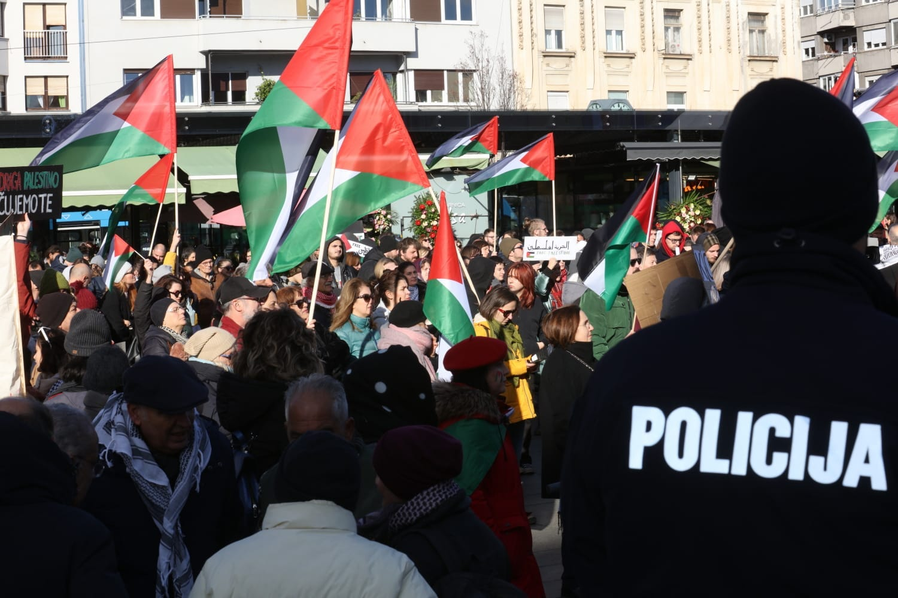

Photo: Dag Oršić ©

One such ignorant belief concerns boys and men. It is the boys, teenagers (often unaccompanied minors), young men and adults, who are often forgotten in the boastful programmes of the big humanitarian organisations, the financial provisions of the so-called integration plan, policies and practice when it comes to welcoming people, not to mention the policy of securitisation and respect for the right to protection.

In most cases, human and other rights are applied discriminately, and the males often end up further antagonised, deprived of protection, traumatised and, often, either imprisoned during the process or pushed back.

We are not witnessing anything new when it comes to what is going on in Palestine, with the focus being almost solely on the children (understandably given the great percentage of people in Palestine who are children) and women.

At the same time, the men tirelessly care for their communities — finding food when there isn’t any, providing whatever they can to their neighbours, but also digging out the body parts of their loved ones and other people from the rubble, as they take on the difficult and unimaginable tasks of burial, safeguarding, and other traumatic activities imposed on them by the agression and tragedy.

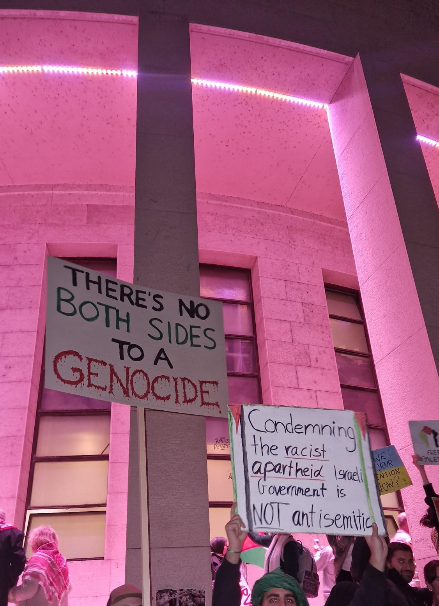

Photo: The Initiative

It is important to keep in mind that those who are lucky enough to survive this horrendous invasion, the bombings and the starvation, and who eventually have to ask for international protection will end up, once again, stigmatised and scrutinised, seldom included in the statistics of ‘successful asylum claims’.

 s by the Initiative](../assets/951f56502503/1*LSigxtJBn5PffRh0xaj9Iw.jpeg)

From one of the [press release](https://www.facebook.com/free.palestine.from.croatia/posts/pfbid026iQgXjCpwteaRx9SH2JNhhCGgxGEm2p4ggocUVPfXtwdxAWQqwrtpJkR4HYt8ACVl) s by the Initiative

A surge of requests for international protection cannot, of course, be seen in the official statistics of the Ministry of the Interior, given everything we know about the circumstances around accessing the mechanism of international protection consequent to Croatia’s geographical and strategic position within the EU. This is evident in the many reports on illegal and unlawful collective expulsions and violent pushbacks, but also because of the obvious inability of people to leave the areas of danger or places they had previously been internally displaced to.

The latest report on the number of asylum requests in Croatia lists 188 Palestinians as officially registered asylum seekers in the period from January 1st to September 30th 2023, while 2022 saw 32 official asylum requests documented under Palestine.

As a country who has been through wartime suffering and displacement, and has pleaded with the international community to intervene in order for the gunfire, grenades and tanks to stop, there should be no doubt Croatia should always be supporting calls for ceasefire, peace and diplomatic solutions to political questions as opposed to agression. However, the official status of Croatia is that of support for Israel, which was most clearly demonstrated with the first vote at the UN regarding a ceasefire.

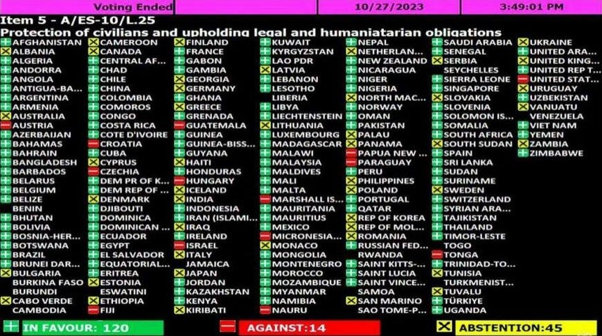

Following this, there was a(n unexpected) public outcry. Soon afterwards, the Free Palestine Initiative released the [NOT IN OUR NAME](https://m.facebook.com/story.php?story_fbid=pfbid033X9e6rLwHAD4CNnLj31Zget6d7FMUgg556jNZpLuEKboFfBiLPgfpWtfYGFnvrb9l&id=100081456813543&sfnsn=mo) statement and simultaneously organized two direct actions, one in front of the Croatian government building, the other in front of the Embassy of Israel on October 31st.

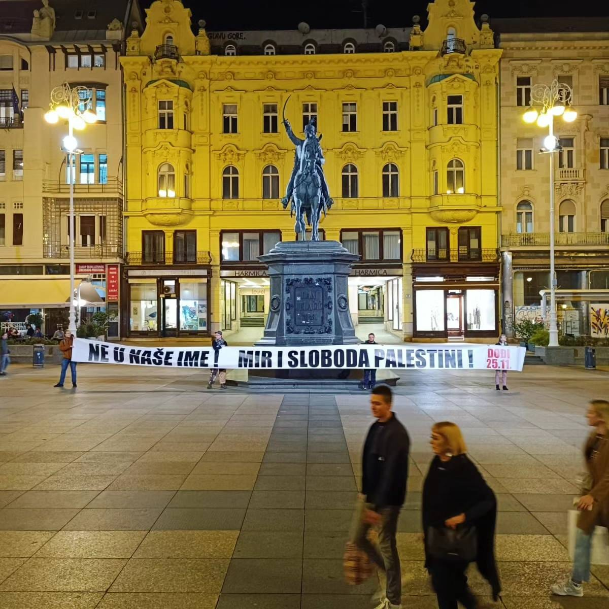

“Not in our name! Peace and freedom to Palestine!”

This and other initiatives, gatherings and actions by the Initiative made way for an increasing number of public figures and opinion makers to speak up about the horrors of the atrocities in Palestine and express their condemnation of such violence.

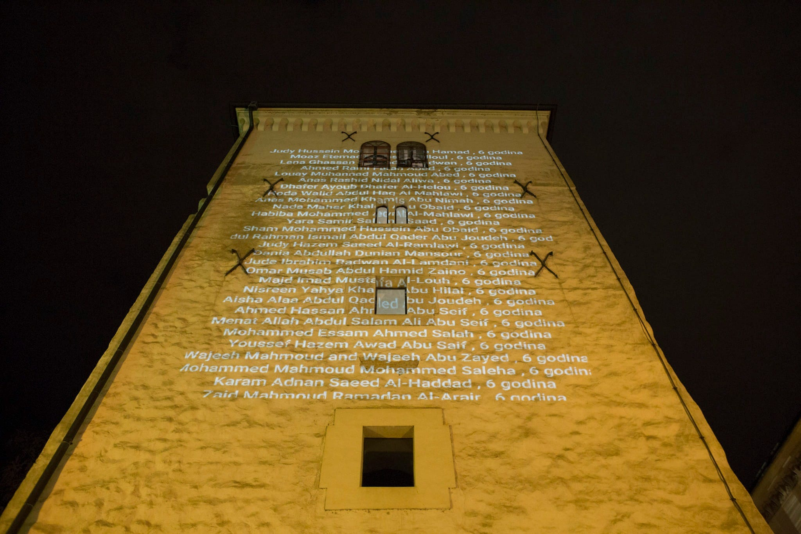

During a weekend in December, activists of the Initiative projected the names of those killed during more than two months of war in Gaza at various locations of Advent in Zagreb. On the decorated streets of Zagreb, among people rushing in search of gifts, this action of the Initiative reminded the public that Bethlehem canceled Christmas this year for a reason. / Photos: The Initiative

One such example is the [Gaza Monologues](https://docs.google.com/document/d/13zw1x01enLb_kalS0SmqNQ-88d4-7Cc-HOmgJEC4kzk/edit?fbclid=IwAR02VZuJbLFpyarS9IAasj3EkLa7MI7urmRHCgr5yJRTym8qscQtEp1gy1o) , a global project that includes the labour of translation and public reading. The public reading of the monologues was joined by eight popular actors, as well as citizens across Croatia. Another example was a poetry evening titled Gaza, Undated, which was joined by poets protesting against the genocide and seeking freedom and healing.

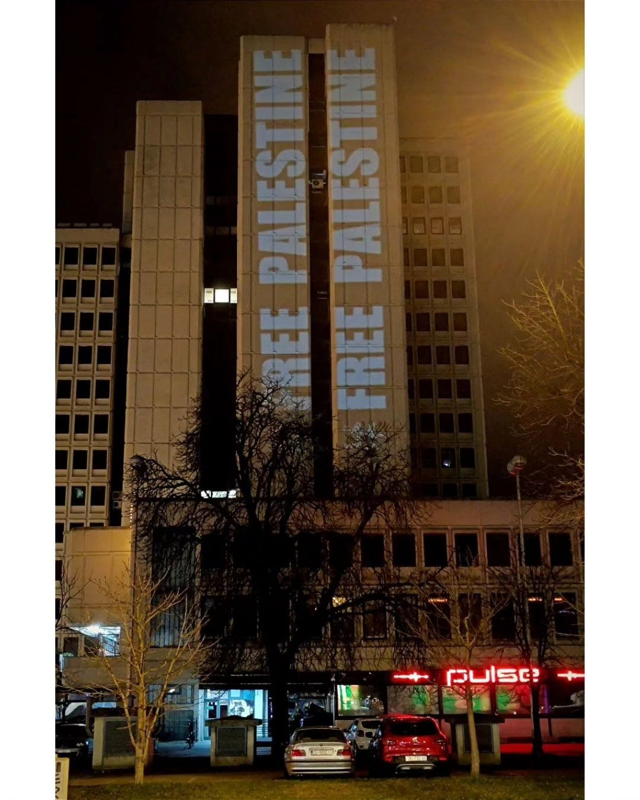

The building the Israeli Embassy in Zagreb, Croatia, January 6, 2024

As the Gazan girls become war journalists and enable us to see through their eyes the most horrible devastation taking place, each one of us who is not there, but cares and wants change, can, should and must do whatever is in our reach and beyond, to keep the world’s attention on what is really taking place and to fight for a change in the policies and decisions taken on our behalf. In the face of such tragedy caused by aggression, there can be no satisfaction, no peace and no instant change while doing any of the symbolic activities we undertake from afar, but it has to be done and we mustn’t stop fighting, talking and writing about Palestine.

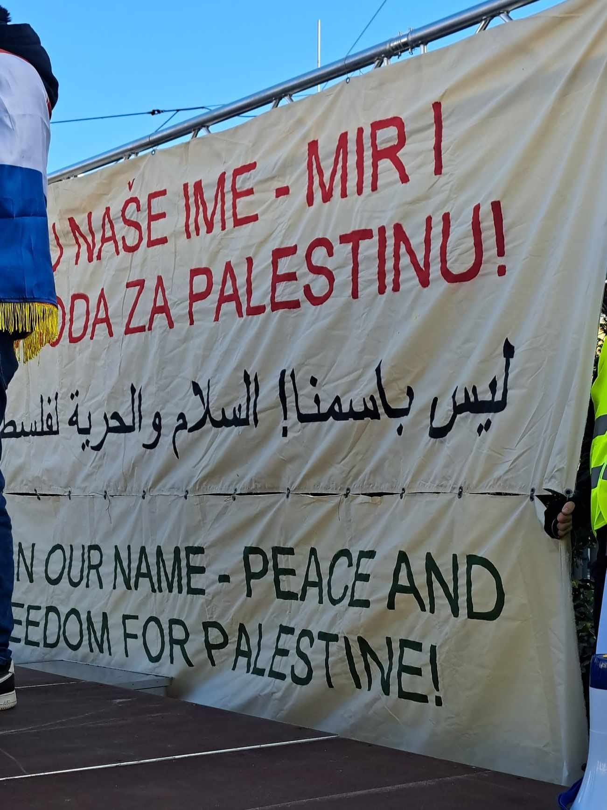

Photo: KR

Even within the groups, organisations, human rights advocates and peace activists there is polarization, as there is within the left. It is precisely this part of the political spectrum that most pro-Palestinian supporters in Croatia are most disappointed with. However, this also opens up a niche for greater inclusivity when it comes to support, action and engagement in the advocacy for Palestine.

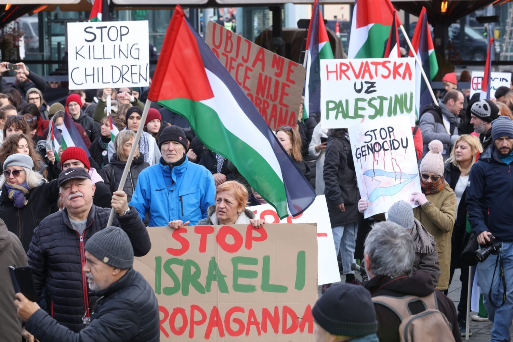

Photo: The Initiative

The Free Palestine Initiative started a series of teach-ins recently and is focusing on expanding the public dialogue with different social groups and communities. Important directions we are moving in currently encompass the labour of weaving solidarity with the Palestinian community, including those evacuated from Gaza, by connecting them with peace and human rights circles; working to build trust and open dialogue with the Jewish community; and public communication with citizens more generally.

Recent crowdfunding for the families of Croatian citizens evacuated from Gaza (at first told by the Government to cover their own evacuation expenses!) which included a series of events and concerts, has shown that support for the people is expressed not only on social media, but also through direct support. It was organised and successfully completed by the Initiative with the support of Slagalica Foundation from Osijek.

The collected funds will be used to cover the costs of health insurance for family members who do not have Croatian citizenship, health insurance for adult Croatian citizens who are not involved in the labour market, recognition of educational diplomas, housing, firewood and daily necessities.

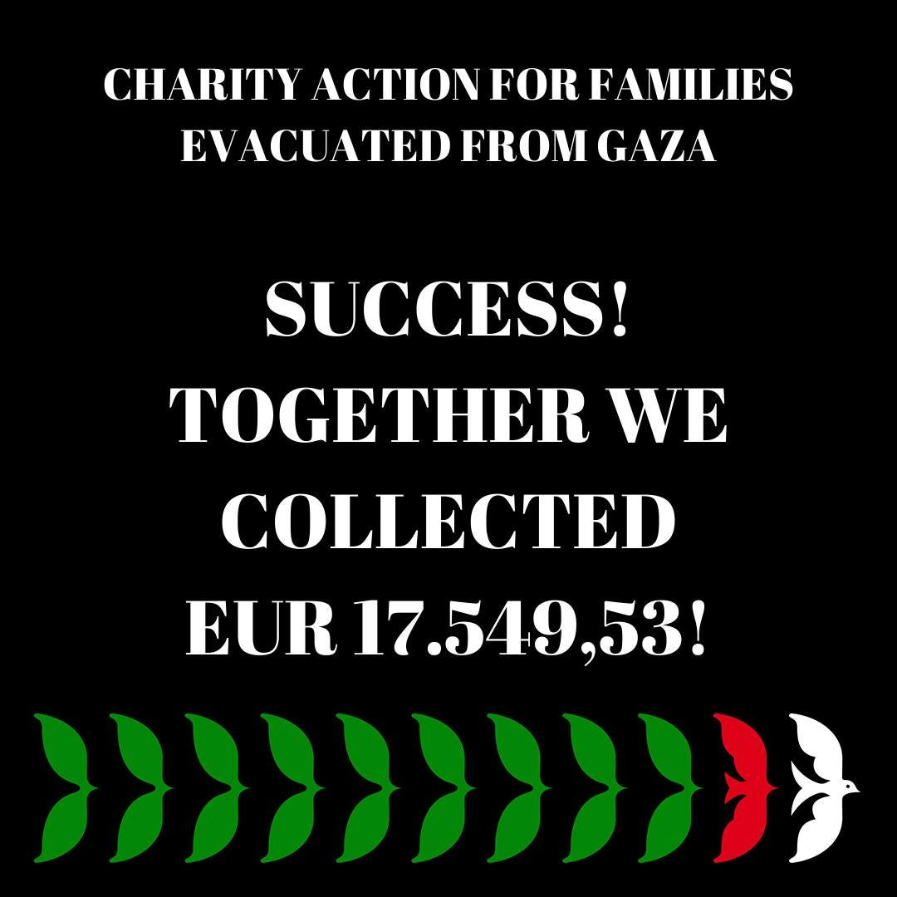

Actions calling for attention, visibility and vigilance organised by the Initiative continue. An important and valuable aspect of these is the fact that they are not organised by any of the official NGOs or similar organisations, with already formed preconcieved notions coming from the officials, but rather by a diverse and dedicated growing number of people wishing justice and peace upon the people in Palestine, with people and not war or politics in mind.

 / Photo: The Initiative](../assets/951f56502503/1*6tmHd6MTwUo1wG_kf9oDkg.jpeg)

Press release from the peaceful solidarity gathering held in November at Kvaternik square in Zagreb available [**here**](https://www.facebook.com/free.palestine.from.croatia/posts/pfbid022nAFuPSxVjxvWZNLvXQSNkFrfNazSeuLbkDAxPhoe8Knd5XBU5AXkbgZs6hWZhuCl) / Photo: The Initiative

As their voice grows, the next Croatian public gathering and march in support of a ceasefire and freedom in Palestine is coming up on the 13th January (see below)...

](../assets/951f56502503/1*6Fqfif1CYQm3VQnQfOvTEg.jpeg)

[Život, sloboda, pravda — marš za Palestinu](https://www.facebook.com/events/3577172852552714?ref=newsfeed)

**Find daily updates and special reports on our [Medium page](https://medium.com/are-you-syrious) .**

**If you wish to contribute, either by writing a report or a story, or by joining the Info team, please let us know!**

**We strive to echo correct news from the ground through collaboration and fairness. Every effort has been made to credit organisations and individuals with regard to the supply of information, video, and photo material (in cases where the source wanted to be accredited). Please notify us regarding corrections.**

**If there’s anything you want to share or comment, contact us through Facebook, Twitter or write to: ays.info.team@gmail.com**

_[Post](https://medium.com/are-you-syrious/ays-special-talking-palestine-in-croatia-951f56502503) converted from Medium by [ZMediumToMarkdown](https://github.com/ZhgChgLi/ZMediumToMarkdown)._
